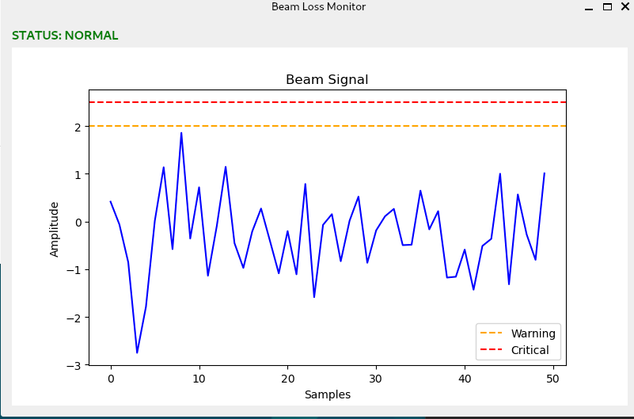

# Beam Loss Monitor Simulator

## Overview

This project implements a simplified **real-time beam monitoring system** inspired by accelerator instrumentation software.

The system simulates detector signals, processes them with a low-latency C++ pipeline, and visualizes the signals in a Python monitoring dashboard.

The architecture mirrors the data-acquisition workflow used in particle accelerators.

---

## Architecture

Detector Simulation (C++)
→ Lock-Free Ring Buffer
→ Real-Time Monitoring
→ Signal Logging
→ Python PyQt6 Dashboard
→ Live Signal Visualization

---

## Features

* Multithreaded C++ data acquisition
* Lock-free ring buffer for real-time streaming
* Latency measurement in microseconds
* Continuous signal logging
* Python PyQt6 monitoring GUI
* Real-time signal plotting
* Warning and critical beam-loss thresholds

---

## Technologies

* C++17
* Python 3
* PyQt6
* Matplotlib
* CMake
* Multithreading
* Lock-free data structures

---

## Build Instructions

```bash
mkdir build
cd build
cmake ..
make
```

Run simulator:

```bash
./blm_simulator
```

Run dashboard:

```bash
python gui/dashboard.py
```

---

## Example Dashboard

The dashboard visualizes the detector signals and highlights beam-loss events.

Green: Normal operation
Orange: Warning threshold
Red: Critical beam loss

---

## Purpose

This project demonstrates techniques used in **real-time monitoring software for accelerator instrumentation**, including multithreaded pipelines, lock-free buffers, and monitoring GUIs.

---

## Author

Gramshi E D


